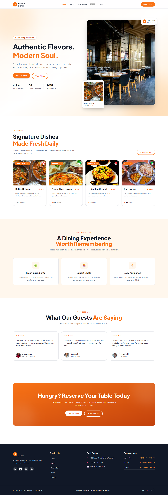

# Saffron & Sage

A modern, responsive restaurant website for Saffron & Sage, featuring signature dishes, restaurant information, and an interactive table reservation flow.

**Live website:** [saffron-and-sage-mocha.vercel.app](https://saffron-and-sage-mocha.vercel.app/)

## Screenshot



## Features

- Responsive pages for Home, Menu, About, Contact, and Reservations
- Menu browsing with category filters, dish search, and a vegetarian-only filter
- Multi-step table reservation experience with a booking confirmation screen
- Restaurant story, featured dishes, guest testimonials, opening hours, and contact details
- Responsive navigation and reusable UI components

## Built With

- React 19
- Vite
- React Router
- Tailwind CSS 4

## Getting Started

### Requirements

- Node.js (LTS recommended)
- npm

### Install and run locally

```bash
git clone https://github.com/Shahiskhan/saffron-and-sage.git
cd saffron-and-sage
npm install
npm run dev
```

Vite prints the local development URL in the terminal after the server starts.

## Available Scripts

| Command | Description |
| --- | --- |
| `npm run dev` | Start the local development server |
| `npm run build` | Create a production build in `dist/` |
| `npm run preview` | Preview the production build locally |
| `npm run lint` | Run Oxlint |

## Project Notes

The reservation and contact flows currently run in the browser for demonstration purposes. They do not submit data to a backend, and the reservation payment step does not process real payments.

## Deployment

The live site is deployed on [Vercel](https://vercel.com/). To deploy your own copy, import this repository into Vercel and use the default Vite build settings:

- Build command: `npm run build`
- Output directory: `dist`
